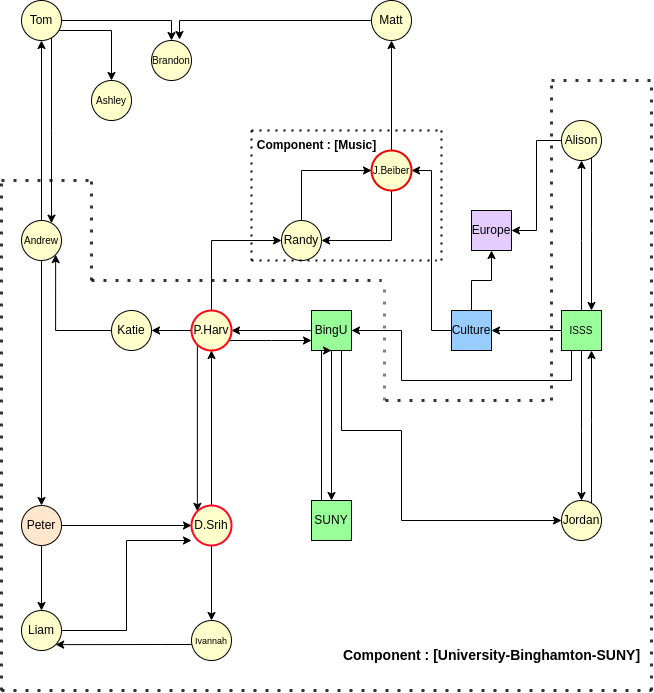

## Description
Social Media Networks are used to describe the relationship between various entities on a social media platform. These networks typically leverage graph theory and properties of graphs to gain some insight into the kinds of relationships modeled. In this project, I aim to explore a particular property of such graphs called strongly connected components, and apply this concept to a common problem in social media networks : Advertisement targeting (Community
detection).

## Social Media Advertisement Targeting

A common requirement in any social media platform is to publish advertisements.

Advertisements cannot be published and broadcast to everyone on the network. There needs to
be specific segments of the people on the network that will be shown the advertisement, based
on the fact that these people are more likely to find it useful. This is formally called targeted
advertisements. There are different ways of targeting based on segmentation, demographics
etc. Here we will explore how SCCs can help in targeting advertisements.

## Setup

The network has two basic types of nodes: People and Pages, each object can be modeled as
follows :
```
People :{value=”Alice”, type = “People”, attr=”{Age: 22, Sex: F}”}
People (Influencer) : {value=”Michael Jackson”, type = “Influencer”,
attr=”{Age: 22, Sex: F, Tags:{“Music”, “Rock”}, Weight: 4000}”}
Pages : {value=”Binghamton University”, type = “Page”, attr=”{Age: 22, Sex: F,
Tags:{“Music”, “Rock”}, Weight: 200}”}
```
Certain People nodes (Influencers) and Pages have additional attributes such as Tags and
Weights. Every page will have a tag describing what that Page is about. Each Page will alsohave a Weight, based on the degree of the node - this weight basically tells us how popular (or
influential) this node is. This will be important when we tackle a different problem called
Component Labeling.

Consider an example network as shown below. It has many People nodes (circular) and Page
nodes (squares). Some People nodes have red circular borders. These are termed “Influencer”
nodes and we will see their significance in the next section. This network shows certain pages
that are related to Binghamton University : ISSS, BinghamtonUniversity, and SUNY. There are
also other Pages such as Culture, Europe etc. All other nodes are people nodes, and the
connections between these nodes indicate that they follow each other.



When we run an SCC detection algorithm on this such as Kosaraju on this graph, we get the
following components (Implemented program output) :

```
Component [ -University-Binghamton-SUNY- ] :
-----------------------------------------------------
SUNY ( Page )
Katie ( Person )
Tom ( Person )
Andrew ( Person )
Peter ( Person )
Ivannah ( Person )
Liam ( Person )
D Srihari ( Person (Influencer) )
Harvey Stenger ( Person (Influencer) )
BingU ( Page )
Jordan ( Person )
BingISSS ( Page )
Alison ( Person )
Component [ -Music- ] :
-----------------------------------------------------
Justin Beiber ( Influencer )
Randy ( Person )
```
Here, we can see that there is a large component related to Binghamton university, and a
smaller one related to the two node components (labeled music). By default, every single node
is a component itself, but we will be ignoring those as they are not relevant to this problem. The
words within the square brackets next to each component is the component’s label.

## Component Labeling
Component labeling is important because that is the only way to give meaning to the group of
nodes on the network. In order to use these components in a meaningful way, we need to
capture the common attributes between all the nodes within the component.

In order to make this accurate, I designate some nodes as influencer nodes. These nodes have
a high number of incoming and outgoing edges. In terms of graphs, these nodes have a high
“degree”. These influencer nodes typically have a greater influence on the final label of the
component, since it makes sense intuitively. If there is a component with influencer nodes such
as Shakespeare and J.K.Rowling, it makes sense that this component most likely has pages
related to books, and people following these pages are book readers.

In the example above, certain nodes have a red border. Example, P.Harvey (President Harvey)
and D.Srih (Dean Srihari) are such highly popular influencer nodes.
Influencer nodes and pages have Tags and Weights. Each tag is a string describing the node.
For example, a page “SUNY” may have tags “New York”, “University”, etc.The Weights on the page and influencer nodes depend on the degree of the node. A relatively
less popular page such as SUNY will have a lower weight than for example an extremely
popular celebrity such as Michael Jackson. Taking all this into account, we can have a simple
algorithm to take the largest weighted nodes from the component subgraph and derive a short
label that summarizes the characteristics of the group (and component).

**Algorithm:**
1. Compute all nodes on the graph with high degree (large number of incoming and
outgoing connections) and store these in an array : iNodes.
2. Select all the Pages in the graph and store these in the Pages array.
3. For each iNode, Page assign a weight based on its degree, store these weights in Win
and Wp arrays.
4. Sort decreasing (Win), Sort decreasing (Wp)
5. Based on highest weight, use that particular weight or page’s [Tags] array to add the tag
to the final label.

**Implementation (weights hardcoded):**
```
# Component Labeling Algorithm
for j in range(len(scc_output)):
    compName = ""
    maxWeight = -1
    for v in scc_output[j]:
        if(v.attr.get("Weight") != None):
            sorted(v.attr.get("Weight"), -1)
                if(v.attr.get("Weight")>maxWeight):
                maxWeight = v.attr.get("Weight")
                cNm = ""
                for i,e in enumerate(v.attr.get("Tags")):
                    cNm = cNm+"-"+e
                compName = cNm
    if(compName == ""):
        compName = "-Default"
    compNames.append(compName+"-")
```

**Time Complexity:** **O(N * NlogN)** where N is the number of Vertices.

In order to sort the weight arrays, we need NlogN time. We need to go through each node in
each component and assign a label to it. In doing so, we go through every node in the graph. If
there are N nodes, we go over it N times.

Therefore : N (check tag based weights) * NlogN (sort) => O(N*NlogN) is the time complexity.


Once we have Components and Labels, it is easy to see how we can use this for advertisement
targeting. If for example, we have a book publisher like Barnes & Noble who wants to publish
ads for a new textbook, we can simply match with component labels such as ‘University’ and
broadcast the advertisement to every node within these components.
We can go further and match with ‘Binghamton’ and ‘University’ to refine the nodes which are
targeted.

The process of identifying components and labeling them can be done at many levels.
Components themselves can be considered as nodes and then super-components can be
formed and labeled and so on.

Outside the context of advertisement targeting this approach can be used for general
community detection in social media networks.

## Results
Component [ -University-Binghamton-SUNY- ]: 
 
SUNY ( Page )
Katie ( Person )
Tom ( Person )
Andrew ( Person )
Peter ( Person )
Ivannah ( Person )
Liam ( Person )
D Srihari ( Person (Influencer) )
Harvey Stenger ( Person (Influencer) )
BingU ( Page )
Jordan ( Person )
BingISSS ( Page )
Alison ( Person )

Component [ -Culture-Music-Art- ] : 
 

Culture ( Page )

Component [ -German-British-Dutch- ] : 
 

European Culture ( Page )

Component [ -Default- ] : 

Brandon ( Person )

Component [ -Music- ] : 
 
Justin Beiber ( Infuencer )
Randy ( Person )

## Instructions
To run the program, make sure python3 is installed, then go to the directory containing the SCC_SMN.py file and execute the command (in terminal):


`python3 SCC_SMN.py`


**Note: The input graph is fixed and the adjacency list is hardcoded into the program, according to the graph depicted in the report.**


**Please read the [Report.pdf](https://github.com/karsujo/AdTargettingSCC/blob/master/Report.pdf) document for a detailed description and analysis**